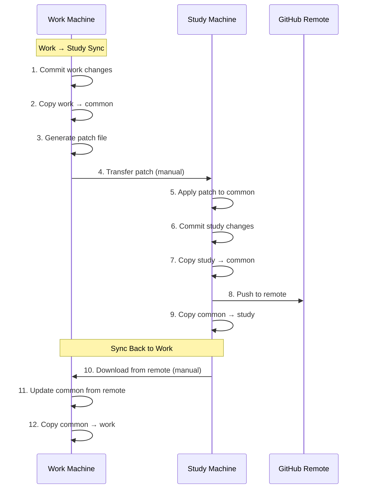

# Work to Study to Work Process

See "Sync Flow Diagram" for better understanding.

## Work → Study

### Common on Work - Open Terminal

```sh
source .env

cd $WORK_VAULT
git add .
git commit -m "Work to Common. Ready for sync"


# Apply Changes, Build Patch
cd $COMMON_VAULT/..

# - `main` should had already been up to date with common-remote.
# - you would already be on `dev` branch

# - checkout `dev` branch.
git checkout dev

# Copy the changes
./_scripts/copy-vault.sh work common

# Verfiy and Commit
git add .
git commit -m "Changes $(date +%Y%m%d-%H%M)"

# Generate Patch from main
git diff main dev -- > "obs-changes-$(date +%Y%m%d-%H%M).patch"
```

Now you have all changes from _work_ to _common on work_.

**Copy the patch to common clipboard**

---

### Common on Study - Open Terminal

_Common Vault with Remote Sync access_

```sh
source .env

cd $COMMON_VAULT/..
git branch -D master_patched
git checkout -b master_patched
touch diff.patch
```

Copy and paste contents to `diff.patch`.

```sh
git apply --3way --reject --whitespace=nowarn --allow-binary-replacement diff.patch
```

Here, the flags are:

- `--3way` - Use 3-way merge algorithm (reduces .rej files)
- `--reject` - Create .rej files for failed hunks (fallback when 3-way fails)
- `--whitespace=nowarn` - Ignore whitespace issues
- `--allow-binary-replacement` - Handle binary files

Do, `sh` then run below, `ctrl + d` to exit terminal

```sh
# Auto-resolve simple rejections, like whitespace
for rej in *.rej; do
  if [[ -f "$rej" ]]; then
    echo "Found rejection: $rej"
    # Check if it's just whitespace/empty line issues
    if grep -q "^[+-]\s*$" "$rej"; then
      echo "Simple whitespace rejection - auto-resolving"
      rm "$rej"
    fi
  fi
done
```

**Verify changes**, review remaining `*.rej`.

```sh
rm diff.patch
git add .
git commit -m "patched"
```

Now you have all changes from _work_ to _common on study_.

**Make Study ready for sync**

Verify the changes in files and commit.

```sh
cd $STUDY_VAULT
git add .
git commit -m "Study to common. Ready for sync."
```

**Copy from Study**

```sh
cd $COMMON_VAULT/..

# copy from study
./_scripts/copy-vault.sh study common

# verify changes and commit to common
git add .
git commit -m "Study to common"
```

Now you have changes from _study_ to _common on study_, as well. Now _common on study_ has all changes.

Let us push to remote:

```sh
# merge to master
git checkout master
git merge master_patched

# commit and push
git add .
git commit -m "patched_merged"
git push
```

Now your _common on remote_ has changes from _work_ and _study_. Now sync it back to _work_ and _study_.

**Copy to Study Vault**

```sh
./_scripts/copy-vault.sh common study
```

**Commit on Study**

```sh
cd $STUDY_VAULT
git add .
git commit -m "Common to Study. Sync Complete"
git push
```

---

### Common on Work - Open the Terminal

Sync _Common on Remote_ to _Common on Work_

Dowonload and update main branch.

```sh
source .env
cd $COMMON_VAULT/..

git checkout main
git branch -D dev
mv .git ../tmp.git/
mv .env ../tmp.env
mv dev ../tmp.dev/
rm -rf *.*
yes | rm -rf *
rm -rf .*
mv ../tmp.git ./.git
mv ../tmp.env ./.env
mv ../tmp.dev ./dev
curl -L https://github.com/iYadavVaibhav/obsidian-common/archive/refs/heads/master.zip > master.zip
unzip master.zip
rm master.zip
cp -r ./obsidian-common-master/. .
rm -rf obsidian-common-master
git checkout -b dev

# Common to Work
./_scripts/copy-vault.sh common work
```

**Commit on Work**

```sh
cd $WORK_VAULT
# git status
git add .
git commit -m "Common to Work. Sync Complete"
```

Now work is synced with study and common.


## Sync Flow Diagram



- `Common Repo` exists as
  - _Common on Work_ Machine - cannot access remote
  - _Common on Remote_ Machine
  - _Common on Study_ Machine - can access remote

- Ensure
  - Work and Study vault have changes ready to sync.
